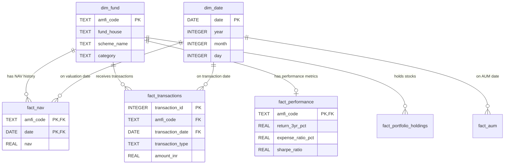

# Bluestock Mutual Fund Analytics Data Dictionary

This document details the data schema, table structures, column definitions, data types, and business rules for the `bluestock_mf.db` SQLite Database.

---

## Table of Contents
1. [dim_fund](#1-dim_fund)
2. [dim_date](#2-dim_date)
3. [fact_nav](#3-fact_nav)
4. [fact_transactions](#4-fact_transactions)
5. [fact_performance](#5-fact_performance)
6. [fact_aum](#6-fact_aum)
7. [fact_monthly_sip](#7-fact_monthly_sip)
8. [fact_category_inflows](#8-fact_category_inflows)
9. [fact_industry_folio](#9-fact_industry_folio)
10. [fact_portfolio_holdings](#10-fact_portfolio_holdings)
11. [fact_benchmark_indices](#11-fact_benchmark_indices)

---

### 1. `dim_fund`
**Description**: Master dimension table containing metadata for mutual fund schemes registered under AMFI.  
**Primary Key**: `amfi_code`  
**Source**: `01_fund_master.csv`

| Column Name | Data Type | Key Type | Business Definition | Sample / Allowed Values |
| :--- | :--- | :--- | :--- | :--- |
| `amfi_code` | TEXT | PRIMARY KEY | Unique Association of Mutual Funds in India (AMFI) scheme identifier | `119551`, `120842` |
| `fund_house` | TEXT | - | Asset Management Company (AMC) name | `SBI Mutual Fund`, `Axis Mutual Fund` |
| `scheme_name` | TEXT | - | Official scheme name | `SBI Bluechip Fund - Direct Plan - Growth` |
| `category` | TEXT | - | Broad asset category (Equity, Debt, Hybrid, Solution Oriented, Others) | `Equity`, `Debt` |
| `sub_category` | TEXT | - | SEBI-defined scheme sub-category | `Large Cap`, `Flexi Cap`, `Small Cap` |
| `plan` | TEXT | - | Investment route plan type | `Direct Plan`, `Regular Plan` |
| `launch_date` | DATE | - | Scheme inception date (YYYY-MM-DD) | `2006-02-14` |
| `benchmark` | TEXT | - | Comparative benchmark index for scheme performance | `NIFTY 50 TRI`, `BSE 500 TRI` |
| `expense_ratio_pct` | REAL | - | Annual percentage fee charged by fund management | `0.85`, `1.20` |
| `exit_load_pct` | REAL | - | Percentage penalty fee levied on early redemption | `1.00`, `0.00` |
| `min_sip_amount` | REAL | - | Minimum monthly SIP investment amount in INR | `500.0`, `1000.0` |
| `min_lumpsum_amount` | REAL | - | Minimum initial lump-sum investment amount in INR | `1000.0`, `5000.0` |
| `fund_manager` | TEXT | - | Designated fund manager(s) | `Dinesh Balachandran` |
| `risk_category` | TEXT | - | Riskometer classification assigned as per SEBI regulations | `Very High`, `High`, `Moderate` |
| `sebi_category_code` | TEXT | - | Standard SEBI categorization code | `EC01`, `EC02` |

---

### 2. `dim_date`
**Description**: Standard date dimension table facilitating temporal analytics, YoY growth, and monthly aggregations.  
**Primary Key**: `date`  
**Source**: Derived from `fact_nav`, `fact_transactions`, `fact_aum`, `fact_benchmark_indices`

| Column Name | Data Type | Key Type | Business Definition | Sample / Allowed Values |
| :--- | :--- | :--- | :--- | :--- |
| `date` | DATE | PRIMARY KEY | Calendar date in ISO 8601 format (YYYY-MM-DD) | `2024-01-03` |
| `year` | INTEGER | - | 4-digit calendar year | `2022`, `2024`, `2025` |
| `month` | INTEGER | - | Calendar month number (1–12) | `1`, `6`, `12` |
| `day` | INTEGER | - | Day of the month (1–31) | `1`, `15`, `31` |
| `quarter` | INTEGER | - | Financial calendar quarter (1–4) | `1`, `2`, `3`, `4` |
| `day_name` | TEXT | - | Name of the day | `Monday`, `Friday` |
| `month_name` | TEXT | - | Full month name | `January`, `December` |
| `is_weekend` | INTEGER | - | Binary indicator flag (1 for Saturday/Sunday, 0 for Weekday) | `0`, `1` |

---

### 3. `fact_nav`
**Description**: Fact table tracking Net Asset Value (NAV) per unit history over time per scheme.  
**Primary Key**: `(amfi_code, date)`  
**Foreign Keys**: `amfi_code` -> `dim_fund(amfi_code)`, `date` -> `dim_date(date)`  
**Source**: `02_nav_history.csv`

| Column Name | Data Type | Key Type | Business Definition | Sample / Allowed Values |
| :--- | :--- | :--- | :--- | :--- |
| `amfi_code` | TEXT | PK, FK | Foreign key referencing the scheme in `dim_fund` | `119551` |
| `date` | DATE | PK, FK | Valuation date | `2024-01-03` |
| `nav` | REAL | - | Net Asset Value in INR per unit (Forward-filled for non-trading days) | `54.3856`, `112.4500` |

---

### 4. `fact_transactions`
**Description**: Fact table recording individual investor transactions across schemes.  
**Primary Key**: `transaction_id`  
**Foreign Keys**: `amfi_code` -> `dim_fund(amfi_code)`, `transaction_date` -> `dim_date(date)`  
**Source**: `08_investor_transactions.csv`

| Column Name | Data Type | Key Type | Business Definition | Sample / Allowed Values |
| :--- | :--- | :--- | :--- | :--- |
| `transaction_id` | INTEGER | PRIMARY KEY | Auto-incrementing unique transaction record ID | `1`, `2`, `32778` |
| `investor_id` | TEXT | - | Anonymous unique investor identifier | `INV003054` |
| `transaction_date` | DATE | FK | Date when transaction was executed | `2024-01-01` |
| `amfi_code` | TEXT | FK | Target mutual fund scheme code | `119551` |
| `transaction_type` | TEXT | - | Transaction nature category | `SIP`, `Lumpsum`, `Redemption` |
| `amount_inr` | REAL | - | Monetary value of transaction in INR (Validated > 0) | `5000.0`, `25000.0` |
| `state` | TEXT | - | Investor location state | `Maharashtra`, `Karnataka` |
| `city` | TEXT | - | Investor location city | `Mumbai`, `Bengaluru` |
| `city_tier` | TEXT | - | Geographic tier classification | `Tier 1`, `Tier 2`, `Tier 3` |
| `age_group` | TEXT | - | Investor age group bracket | `25-34`, `35-44`, `45-54` |
| `gender` | TEXT | - | Investor gender | `Male`, `Female` |
| `annual_income_lakh` | REAL | - | Self-reported annual income in Lakh INR | `12.5`, `24.0` |
| `payment_mode` | TEXT | - | Payment gateway / channel used | `UPI`, `Net Banking`, `Cheque` |
| `kyc_status` | TEXT | - | Investor Know-Your-Customer verification status | `Verified`, `Pending` |

---

### 5. `fact_performance`
**Description**: Comprehensive performance metrics, risk ratios, and rating grades per scheme.  
**Primary Key**: `amfi_code`  
**Foreign Key**: `amfi_code` -> `dim_fund(amfi_code)`  
**Source**: `07_scheme_performance.csv`

| Column Name | Data Type | Key Type | Business Definition | Sample / Allowed Values |
| :--- | :--- | :--- | :--- | :--- |
| `amfi_code` | TEXT | PK, FK | Scheme code reference | `119551` |
| `scheme_name` | TEXT | - | Scheme name | `SBI Bluechip Fund` |
| `fund_house` | TEXT | - | Mutual fund AMC | `SBI Mutual Fund` |
| `category` | TEXT | - | Scheme category | `Large Cap` |
| `plan` | TEXT | - | Plan type | `Direct Plan` |
| `return_1yr_pct` | REAL | - | 1-year annualized return % | `14.25` |
| `return_3yr_pct` | REAL | - | 3-year CAGR return % | `16.80` |
| `return_5yr_pct` | REAL | - | 5-year CAGR return % | `15.10` |
| `benchmark_3yr_pct` | REAL | - | Benchmark index 3-year return % | `14.50` |
| `alpha` | REAL | - | Excess return relative to benchmark | `2.30` |
| `beta` | REAL | - | Systematic market risk volatility measure | `0.92` |
| `sharpe_ratio` | REAL | - | Risk-adjusted return ratio | `1.45` |
| `sortino_ratio` | REAL | - | Downside risk-adjusted return ratio | `2.10` |
| `std_dev_ann_pct` | REAL | - | Annualized standard deviation (volatility) % | `12.40` |
| `max_drawdown_pct` | REAL | - | Peak-to-trough decline percentage | `-15.20` |
| `aum_crore` | REAL | - | Scheme Asset Under Management in Crore INR | `41828.0` |
| `expense_ratio_pct` | REAL | - | Annual expense ratio % (Checked range 0.1%–2.5%) | `0.85` |
| `morningstar_rating` | REAL | - | Morningstar star rating (1–5) | `4`, `5` |
| `risk_grade` | TEXT | - | Risk category rating | `Moderate`, `High` |
| `sharpe_flag` | TEXT | - | Indicator flag for negative Sharpe ratio | `Normal`, `Negative Sharpe` |
| `expense_ratio_valid` | INTEGER | - | Validation flag for expense ratio within [0.1, 2.5] | `1` |

---

### 6. `fact_aum`
**Description**: Historical Assets Under Management (AUM) trends aggregated by fund house.  
**Primary Key**: `aum_id`  
**Foreign Key**: `date` -> `dim_date(date)`  
**Source**: `03_aum_by_fund_house.csv`

| Column Name | Data Type | Key Type | Business Definition | Sample / Allowed Values |
| :--- | :--- | :--- | :--- | :--- |
| `aum_id` | INTEGER | PRIMARY KEY | Auto-incrementing primary key | `1`, `2` |
| `date` | DATE | FK | Quarter-end / valuation date | `2022-03-31` |
| `fund_house` | TEXT | - | Name of AMC | `SBI Mutual Fund` |
| `aum_lakh_crore` | REAL | - | Total AUM in Lakh Crore INR | `6.05` |
| `aum_crore` | REAL | - | Total AUM in Crore INR | `605000.0` |
| `num_schemes` | INTEGER | - | Number of active schemes managed | `186` |

---

### 7. `fact_monthly_sip`
**Description**: Industry-wide monthly Systematic Investment Plan (SIP) inflow metrics and YoY growth trends.  
**Primary Key**: `month`  
**Source**: `04_monthly_sip_inflows.csv`

| Column Name | Data Type | Key Type | Business Definition | Sample / Allowed Values |
| :--- | :--- | :--- | :--- | :--- |
| `month` | TEXT | PRIMARY KEY | Year-Month string identifier (YYYY-MM) | `2024-01` |
| `sip_inflow_crore` | REAL | - | Monthly aggregate SIP inflows in Crore INR | `18838.0` |
| `active_sip_accounts_crore` | REAL | - | Count of active SIP accounts in Crore | `7.20` |
| `new_sip_accounts_lakh` | REAL | - | New SIP accounts registered in Lakh | `51.84` |
| `sip_aum_lakh_crore` | REAL | - | Total SIP AUM in Lakh Crore INR | `10.25` |
| `yoy_growth_pct` | REAL | - | Year-over-Year growth percentage in SIP inflows | `35.96` |

---

### 8. `fact_category_inflows`
**Description**: Monthly net inflows across scheme asset categories.  
**Primary Key**: `inflow_id`  
**Source**: `05_category_inflows.csv`

| Column Name | Data Type | Key Type | Business Definition | Sample / Allowed Values |
| :--- | :--- | :--- | :--- | :--- |
| `inflow_id` | INTEGER | PRIMARY KEY | Auto-incrementing record ID | `1`, `2` |
| `month` | TEXT | - | Year-Month string (YYYY-MM) | `2024-04` |
| `category` | TEXT | - | Mutual fund category name | `Large Cap`, `Mid Cap` |
| `net_inflow_crore` | REAL | - | Monthly net inflow/outflow in Crore INR | `2413.0`, `3897.0` |

---

### 9. `fact_industry_folio`
**Description**: Total and sector-wise folio count growth across mutual fund industry.  
**Primary Key**: `month`  
**Source**: `06_industry_folio_count.csv`

| Column Name | Data Type | Key Type | Business Definition | Sample / Allowed Values |
| :--- | :--- | :--- | :--- | :--- |
| `month` | TEXT | PRIMARY KEY | Year-Month string identifier (YYYY-MM) | `2022-01` |
| `total_folios_crore` | REAL | - | Industry total folios count in Crore | `13.26` |
| `equity_folios_crore` | REAL | - | Equity category folios in Crore | `9.12` |
| `debt_folios_crore` | REAL | - | Debt category folios in Crore | `0.72` |
| `hybrid_folios_crore` | REAL | - | Hybrid category folios in Crore | `0.80` |
| `others_folios_crore` | REAL | - | Passive / ETF / Index category folios in Crore | `1.33` |

---

### 10. `fact_portfolio_holdings`
**Description**: Stock-level portfolio holding composition per mutual fund scheme.  
**Primary Key**: `holding_id`  
**Foreign Key**: `amfi_code` -> `dim_fund(amfi_code)`  
**Source**: `09_portfolio_holdings.csv`

| Column Name | Data Type | Key Type | Business Definition | Sample / Allowed Values |
| :--- | :--- | :--- | :--- | :--- |
| `holding_id` | INTEGER | PRIMARY KEY | Auto-incrementing primary key | `1`, `2` |
| `amfi_code` | TEXT | FK | Reference scheme code | `119551` |
| `stock_symbol` | TEXT | - | Exchange ticker symbol | `HDFCBANK`, `RELIANCE` |
| `stock_name` | TEXT | - | Full company name | `HDFC Bank Ltd.` |
| `sector` | TEXT | - | Industry sector classification | `Financial Services`, `IT` |
| `weight_pct` | REAL | - | Portfolio weight percentage allocation | `9.45` |
| `market_value_cr` | REAL | - | Holding market valuation in Crore INR | `3952.75` |
| `current_price_inr` | REAL | - | Stock price in INR on portfolio date | `1074.65` |
| `portfolio_date` | DATE | - | Portfolio disclosure date | `2025-12-31` |

---

### 11. `fact_benchmark_indices`
**Description**: Daily closing value price history for major market benchmark indices.  
**Primary Key**: `index_id`  
**Source**: `10_benchmark_indices.csv`

| Column Name | Data Type | Key Type | Business Definition | Sample / Allowed Values |
| :--- | :--- | :--- | :--- | :--- |
| `index_id` | INTEGER | PRIMARY KEY | Auto-incrementing primary key | `1`, `2` |
| `date` | DATE | FK | Market trading date | `2022-01-03` |
| `index_name` | TEXT | - | Benchmark index name | `NIFTY50`, `BSE SENSEX` |
| `close_value` | REAL | - | End-of-day index closing level | `17492.79` |

---

## Schema Diagram (Star Schema Entity Relationship)

